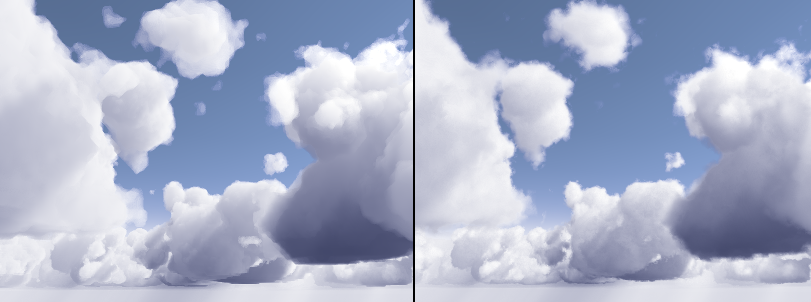

# Cloud rendering configuration guide

This guide explains all the parameters used to control the appearance, quality, and performance of the cloud rendering system.

> For a successful setup, it’s recommended to duplicate a sample `CloudSettings` asset from the example folder and customize from there.

---
## Scene Setup

### Far plane
Make sure the **Camera Far Plane** is set to a large enough distance so that clouds and fog render correctly.

---
### Transmittance Map
Add a ``Transmittance Map`` component to a GameObject in your scene and configure it as needed.  

This component stores volumetric lighting information in a 3D texture. It can be used to significantly reduce lighting computations, or even fully eliminate them by baking the lighting once.

| Parameter                         | Description                                                                                                                                            |
| --------------------------------- | ------------------------------------------------------------------------------------------------------------------------------------------------------ |
| ``Refresh All``                   | Re-creates the 3D texture. Needed when changing texture size                                                                                           |
| ``Calculate Lighting Each Frame`` | Enables real-time computing of 3D lighting. Useful for editing, can be slow if used with big texture sizes and costly lighting settings                |
| ``Map Compute``                   | Reference to the compute shader calculating the lighting                                                                                               |
| ``Clouds``                        | Reference to the ``CloudsPostProcess`` asset                                                                                                           |
| ``Light Min Step Size``           | Minimum step size of the light rays during ray-marching. Lower values lead to better visuals but can slow down the application if computed each frame. |
| ``Texture Width``                 | 3D Texture Width                                                                                                                                       |
| ``Texture Height``                | 3D Texture Height                                                                                                                                      |
| ``Texture Depth``                 | 3D Texture Depth                                                                                                                                       |
> It is necessary to refresh the map after changing settings in the clouds preset.
---
### Clouds Post Process
Add a ``Clouds Post Process`` component to an object in your scene and configure it properly. 

This component is used to render the clouds onto a buffer.

| Parameter             | Description                                          |
| --------------------- | ---------------------------------------------------- |
| ``Active``            | Toggles rendering of the clouds                      |
| ``Refresh``           | Re-creates the rendering buffers (debug only)        |
| ``Cloud Settings``    | Reference to a ``CloudSettings`` preset              |
| `Sun`                 | The directional light used for lighting calculations |
| ``Transmittance Map`` | A transmittance map script, used to compute lighting |

---
### Post Process Stack
Attach a ``Post Process Stack`` component to the camera, and make it reference the ``Clouds Post Process component`` previously created in the ``Processings`` list.

This component takes a list of post-processing steps and applies them sequentially to the final rendered image.

---
## Creating a Cloud Settings Asset

To create a new settings asset:

> **Menu**: `Assets > Create > Rendering > CloudSettings`

> When editing the cloud settings, it is recommended to temporarily turn on `Calculate Lighting Each Frame` from the ``Transmittance Map`` in order to preview the lighting changes in real time.
---
### Shaders and Compute
This section only references the shaders and material used by the system. The material must use the Cloud Shader provided by the package.

| Parameter                 | Description                                                                                                  |
| ------------------------- | ------------------------------------------------------------------------------------------------------------ |
| `Cloud Shader`            | Should point to the fragment shader used during clouds post processing.                                      |
| ``Cloud Compute Shader``  | Should point to the compute shader responsible for computing transmittance and lighting values of each pixel |
| ``Post Process Material`` | Should point to a material using the Cloud Shader referenced previously                                      |

---
### Containers
Clouds and fog are rendered inside a bounding box defined by the following:

| Parameter         | Description                            |
| ----------------- | -------------------------------------- |
| `Clouds Position` | World position of the cloud container. |
| `Clouds Scale`    | World size of the cloud container.     |
| `Fog Position`    | World position of the fog container.   |
| ``Fog Scale``     | World size of the fog container.       |

**Important**: Clouds are only rendered inside the fog volume, so make sure the fog container is larger than the clouds container.

---
### Shape
A **Signed Distance Field (SDF)** stored in a 3D texture defines the shape of the cloudscape. It allows efficient raymarching and detail shaping.

| Parameter           | Description                                                                        |
| ------------------- | ---------------------------------------------------------------------------------- |
| ``SDF Texture``     | A reference to the SDF texture defining the cloudscape                             |
| `SDF Texture Scale` | Defines the scale of one repetition of the 3D texture in world space.              |
| `Global Density`    | Controls the base density of the cloud volume. Affects lighting and visual detail. |

Effect of `Global Density` on lighting and detail:

---
### Erosion

Erosion adds high-frequency detail to the cloud shape using a secondary 3D texture.

Left: erosion off, right: erosion on:

| Parameter               | Description                                             |
| ----------------------- | ------------------------------------------------------- |
| `Use Erosion_Shape`     | Enables erosion in the shape generation pass.           |
| `Use Erosion_AO`        | Applies erosion to ambient occlusion calculation.       |
| `Use Erosion_SunLight`  | Applies erosion to sunlight shading.                    |
| ``Erosion Texture``     | The 3D texture used to sample erosion                   |
| `Erosion World Scale`   | Controls the world thickness of the erosion layer.      |
| `Erosion Texture Scale` | Scales the erosion 3D texture in world space.           |
| `Erosion Intensity`     | Controls the blend intensity of the erosion detail.     |
| `Erosion Speed`         | Offsets the erosion pattern over time to simulate wind. |
> Use tileable textures to prevent visible seams. The included erosion texture is recommended.

---
### Lighting

| Parameter                | Description                                                                                                                      |
| ------------------------ | -------------------------------------------------------------------------------------------------------------------------------- |
| `Use Sun Light`          | Enables the directional sunlight in the lighting model.                                                                          |
| `Sunlight Absorption`    | Controls how much sunlight is absorbed by cloud particles. Higher values darken clouds and increase visual contrast.             |
| `Directional Scattering` | Controls how strongly light is scattered forward. Higher values make clouds appear brighter when viewed toward the light source. |
| `Light Multiplier`       | Multiplies the directional light color. Useful if the directional light intensity is not 1.0.                                    |

Example of different `Sunlight Absorption` values:

Visual comparison of `Directional Scattering` off and on:

 

Example: Light intensity of 1.25 compensated with a ``Light Multiplier`` of 0.6.

---
### Ambient Occlusion
Ambient occlusion darkens regions where light is less likely to reach due to surrounding particles.

| Parameter      | Description                                                                                                                 |
| -------------- | --------------------------------------------------------------------------------------------------------------------------- |
| ``Use AO``     | Toggles ambient occlusion                                                                                                   |
| `AO_Offset`    | Distance used to sample neighboring positions for AO. Higher values highlight large shapes. Lower values show fine details. |
| `AO_Intensity` | Multiplier for AO contribution. Higher values create darker, more defined shapes.                                           |

Visual comparison with no AO (left), offset 500 (middle), offset 125 (right):

 

AO intensities of 35 (left), 50 (middle), 60 (right):

 

---
### Shadows

| Parameter           | Description                                                      |
| ------------------- | ---------------------------------------------------------------- |
| `Enable Shadows`    | Enables projection of cloud shadows onto Unity meshes.           |
| `Soft Shadows`      | Uses multiple samples to soften the shadows. Increases GPU cost. |
| `Shadow Color`      | Color tint applied to the cloud shadow.                          |
| `Shadow Multiplier` | Controls the intensity of the projected cloud shadows.           |

Example of different shadow colors:

 

Example of different shadow intensities:

 

---
### Fog

| Parameter      | Description                                            |
| -------------- | ------------------------------------------------------ |
| `Fog Density`  | Controls how dense the air particles are in the scene. |
| `Fog Distance` | Sets how far from the camera fog starts to appear.     |

Renders with different fog density:

---
### Quality Settings

| Parameter             | Description                                                                                                      |
| --------------------- | ---------------------------------------------------------------------------------------------------------------- |
| `Render Scale`        | Resolution scale of the cloud rendering pass. Lower values improve performance but may cause aliasing.           |
| `Render Distance`     | Maximum horizontal distance at which clouds are rendered. Use a high value for proper fog accumulation.          |
| `Cloud Max Steps`     | Maximum number of steps per ray. Lowering this can improve performance but may cause incomplete cloud rendering. |
| `Cloud Min Step Size` | Minimum raymarching step size. Larger values increase speed but reduce detail.                                   |
| `Fog Step Size`       | Raymarching step size for fog. Can be higher than cloud step size since fog has lower frequency detail.          |

Aliasing caused by different render scales:

 

---
### Noise Settings

Raymarching uses 2D noise to offset ray start distances. This helps reduce aliasing caused by discrete ray steps and blends shapes visually.

| Parameter                | Description                                                                                                     |
| ------------------------ | --------------------------------------------------------------------------------------------------------------- |
| `Offset Noise Intensity` | Intensity of the offset applied to ray origins. Higher values reduce aliasing but introduce screen-space noise. |

Without vs. with noise offset:

 

>To create custom shapes, read the [Creating custom cloudscapes](./Creating%20custom%20cloudscapes.md) section.