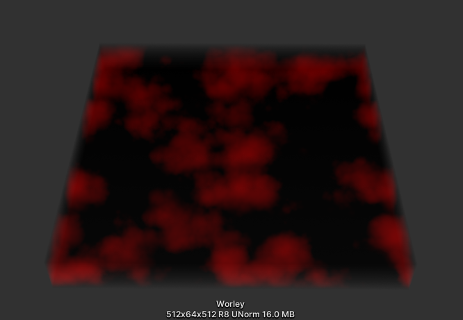
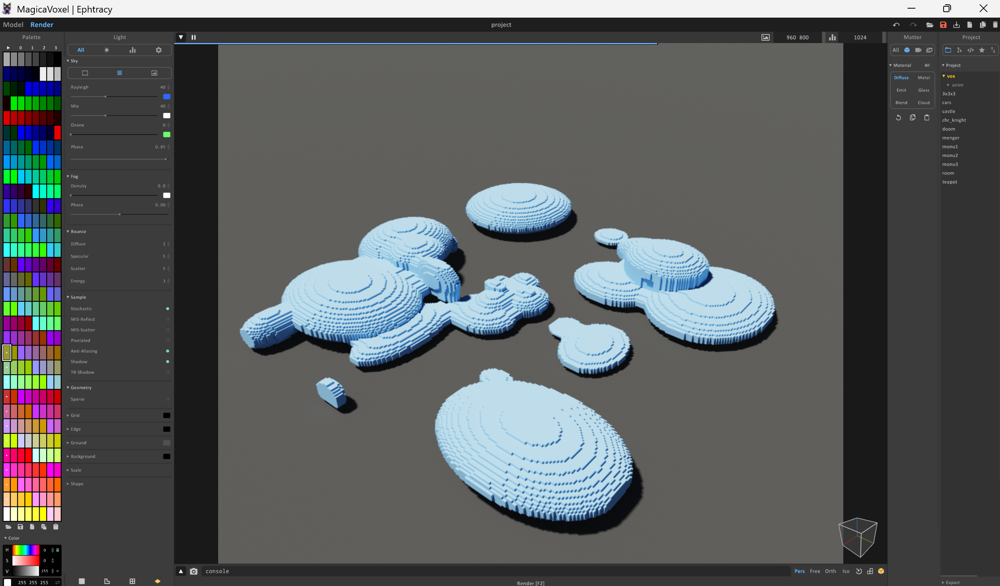
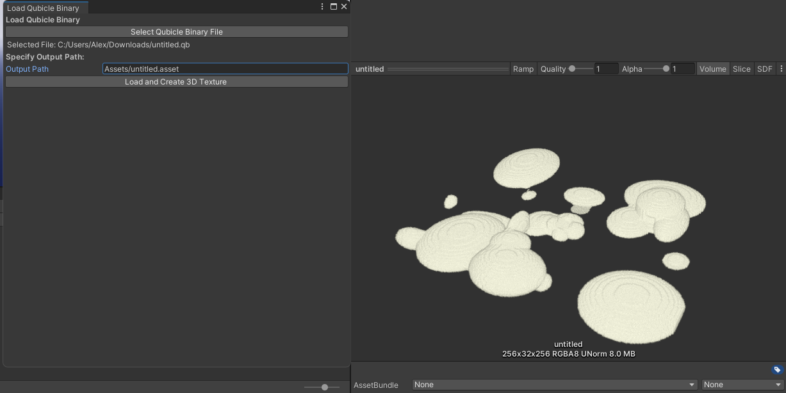
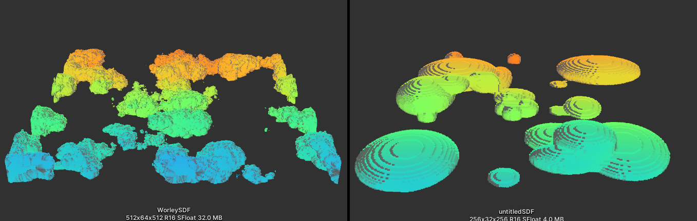

# Creating custom cloudscapes

## Cloud Volume Generation

To create custom cloudscapes, you need to generate an SDF texture from a volume. This can be accomplished through two primary methods:
1. Using the built-in noise generator
2. Importing a custom volume from MagicaVoxel
### Built-in Noise Generator
A complete tooling scene is provided at `Examples/Tooling` with a pre-configured noise generation setup.

**Usage:**
1. Locate the `NoiseGenerator` GameObject in the tooling scene
2. Configure the Worley noise parameters in the inspector
3. Set the output path (without file extension)
4. Click **Compute** to generate the 3D texture

| Parameter              | Type       | Description                                 |
| ---------------------- | ---------- | ------------------------------------------- |
| `Output Path`          | String     | Save location (without extension)           |
| `Resolution`           | Vector3Int | 3D texture dimensions                       |
| `Points`               | Integer    | Random point count (when Use Grid disabled) |
| `Attenuation`          | Float      | Noise falloff/smoothness                    |
| `Radius`               | Float      | Point influence radius                      |
| `Octaves`              | Integer    | Number of detail noise layers               |
| `Use Grid`             | Boolean    | Grid vs random point placement              |
| `Grid Size`            | Integer    | Grid density (when Use Grid enabled)        |
| `Attenuate Vertically` | Boolean    | Enable vertical gradient                    |
| `Top Exponent`         | Float      | Top gradient falloff                        |
| `Bottom Exponent`      | Float      | Bottom gradient falloff                     |
Exemple of a generated texture:

>**Note**: Export the generated noise as a .qb file, convert it to .vox format, then import into MagicaVoxel for manual refinement. 

>This tool converts .qb files to .vox: https://drububu.com/miscellaneous/voxelizer/?out=vox
### MagicaVoxel Import

You can create volumes using MagicaVoxel and import them as .qb files.

> **Software Download:** https://ephtracy.github.io/

Exemple of a cloudscape created with MagicaVoxel (I'm no artist): 

**Import Process:**
1. Create your volume in MagicaVoxel
2. Export as .QB format
3. In Unity, navigate to **Tools → Load Qubicle Binary**
4. Specify output path (must start with `Assets/` and end with `.asset`)

## SDF Conversion

Convert your generated or imported volume to a usable SDF using the Volume To SDF Converter.

> **Tooling Scene with ready to use script:** `Examples/Tooling`

**Setup:**
1. Add the ``Volume To SDF Converter`` script to a GameObject or use the pre-configured setup in the tooling scene
2. Configure the conversion parameters
3. Click **Compute** to start the asynchronous conversion process

| Parameter            | Type          | Description                                                           |
| -------------------- | ------------- | --------------------------------------------------------------------- |
| `SDF Compute Shader` | ComputeShader | Shader for signed distance field computation                          |
| `Volume Texture`     | Texture3D     | Source volume texture to convert                                      |
| `Search Radius`      | Float         | Distance calculation radius (reduce if GPU timeouts occur)            |
| `Output Path`        | String        | Save location (without extension)                                     |
| `Chunk Size`         | Integer       | Processing chunk size (helps prevent GPU timeouts for large textures) |

**Wrapping up :**
- Ensure bilinear filtering is enabled unless voxel-style clouds are intentional.
- You can visualize the SDF in the inspector by selecting the texture asset
- Reference it in your ``CloudSettings`` preset to render the cloudscape

Visualization of the generated SDFs:

Renders of the generated cloud scapes:

