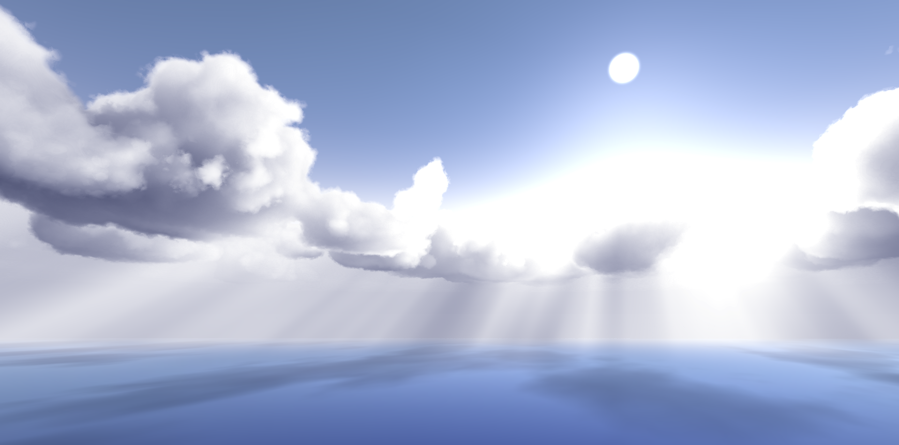

SDF-Clouds is a rendering package for Unity that enables **fast, high-quality volumetric clouds and fog**.

Cloud shapes are defined using a **3D Signed Distance Field (SDF)** stored in a voxel grid, giving you full creative control over the structure of your cloudscapes.

---
## Features
- Realistic lighting
- Volumetric fog
- Cloud shadows on scene objects
- Hand-crafted and procedural shapes
- High render distances
- Baked and dynamic lighting
- Adjustable quality settings
- Compatible with VR

---

## Render Pipeline Compatibility

| Built-in Render Pipeline | Universal Render Pipeline (URP) | High Definition Render Pipeline (HDRP) |
| ------------------------ | ------------------------------- | -------------------------------------- |
| ✅ Compatible             | ➡️Upcoming                      | ❌ Not supported                        |

---
## Documentation

Explore the guides below to get started and customize your cloudscapes:
- [Quick start](Documentation/Quick%20start.md)
- [Cloud Rendering Configuration Guide](Documentation/Cloud%20Rendering%20Configuration%20Guide.md)
- [Creating custom cloudscapes](Documentation/Creating%20custom%20cloudscapes.md)
